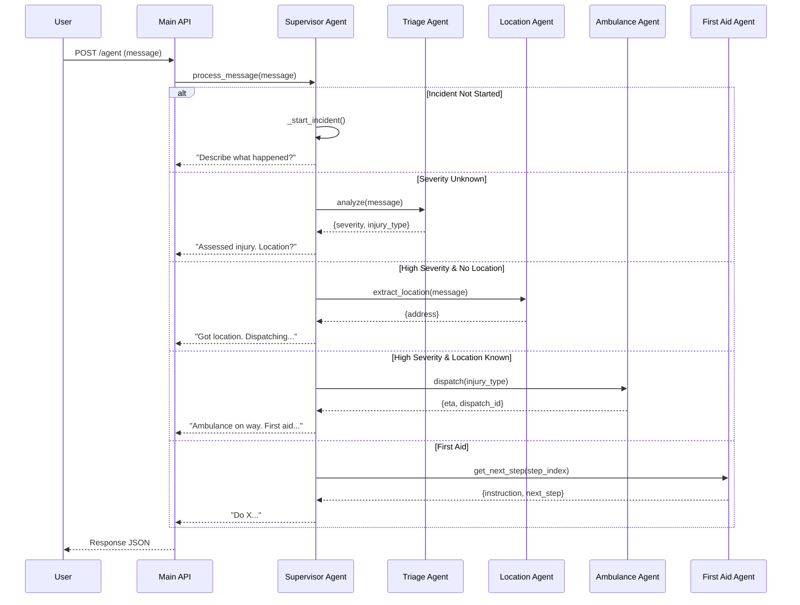

# Agent Before Ambulance - End-to-End Workflow Documentation

This document provides a detailed explanation of the end-to-end workflow for the "Agent Before Ambulance" system. The system is designed to handle emergency situations by guiding users through a structured process involving triage, ambulance dispatch, location tracking, and first aid instructions.

## System Architecture

The core of the system is the **Supervisor Agent**, which orchestrates the interaction between the user and specialized sub-agents. The system is built using **FastAPI** for the backend and uses **Google Generative AI (Gemini)** for natural language processing.

### Key Components

1.  **Main Application (`main.py`)**: The entry point of the backend server. It exposes API endpoints for session management (`/new-session`) and agent chat (`/agent`).
2.  **Supervisor Agent (`agents/supervisor_agent.py`)**: The central controller that manages the conversation state and delegates tasks to other agents.
3.  **Sub-Agents**:
    *   **Triage Agent**: Assesses the severity of the injury.
    *   **Ambulance Agent**: Handles ambulance dispatch logic.
    *   **Location Agent**: Extracts and validates user location.
    *   **First Aid Agent**: Provides step-by-step first aid instructions.
4.  **Session Service (`memory/session_service.py`)**: **[NEW]** In-memory session manager that stores state for each user session.
5.  **Tools (MCP)**:
    *   **Time Tool (`tools/time_tool.py`)**: **[NEW]** An MCP tool that provides the current timestamp for ambulance dispatch records.

---

## Workflow Steps

The workflow is divided into logical stages managed by the `SupervisorAgent`.

### 1. Initialization & Session Start
*   **User Action**: The frontend requests a new session via `POST /new-session`.
*   **System Action**: A unique `session_id` is generated. A new instance of `SupervisorAgent` is created for this session.
*   **State**: `incident_started = False`.

### 2. Incident Reporting (Stage 1)
*   **User Action**: The user sends their first message (e.g., "Help, there's been an accident").
*   **System Action**:
    *   The `SupervisorAgent` receives the message.
    *   It detects that `incident_started` is `False`.
    *   It calls `_start_incident` to acknowledge the emergency and ask for details.
*   **Response**: "I understand. I’m here to help. Can you describe what happened?"
*   **State Update**: `incident_started = True`.

### 3. Triage & Severity Assessment (Stage 2)
*   **User Action**: The user describes the incident (e.g., "My friend fell and is bleeding from the head").
*   **System Action**:
    *   The `SupervisorAgent` sees that `severity` is unknown.
    *   It delegates analysis to the **Triage Agent**.
    *   The **Triage Agent** analyzes the text to determine `accident_type` (e.g., "Head Injury") and `severity` (1-5 scale).
*   **Decision Point**:
    *   If **Severity >= 3** (Serious): The system flags for ambulance dispatch and immediately asks for location if not known.
    *   If **Severity < 3** (Minor): The system proceeds to first aid.
*   **State Update**: `severity`, `injury_type` are set.

### 4. Location Handling (Stage 4 - Interleaved)
*   **Trigger**: If the severity is high and location is missing, or if the user explicitly provides location.
*   **System Action**:
    *   The `SupervisorAgent` delegates to the **Location Agent**.
    *   The **Location Agent** extracts address/coordinates from the user's message.
    *   It provides instructions one step at a time.
*   **User Interaction**: The user confirms completion of each step (e.g., "Done", "Okay").
*   **System Action**: The agent provides the next step until the protocol is complete.
*   **Completion**: Once all steps are done, the agent informs the user that help is on the way or the process is finished.

---

## Example Scenario

1.  **User**: "Help!"
    *   **Bot**: "I understand. I’m here to help. Can you describe what happened?"
2.  **User**: "Car accident, bad leg cut."
    *   **Bot**: "Thanks. Based on your description, this seems like a Deep Cut injury with severity level 4. This is serious. I may need to dispatch an ambulance. Please provide your current location."
3.  **User**: "123 Main St."
    *   **Bot**: "I have your location: 123 Main St. I am dispatching an ambulance now." (Internal: Dispatch triggered). "Ambulance dispatched (ID: 888). Estimated arrival time is 8 minutes. Now let's focus on first aid. Apply direct pressure to the wound."
4.  **User**: "Okay, doing it."
    *   **Bot**: "Keep pressure until bleeding slows. Then bandage tightly."

## Technical Data Flow


    API-->>User: Response JSON
```

---

## Manual Testing Steps

Use these steps to verify the ADK features manually.

### Prerequisites
1.  Ensure the backend server is running: `uvicorn backend.main:app --reload`
2.  Use a tool like **Postman** or `curl` to send requests.

### Test 1: Verify Session & Supervisor Flow
**Goal**: Ensure the Supervisor Agent maintains state across multiple requests using the new Session Service.

1.  **Start Incident**:
    *   **Endpoint**: `POST http://localhost:8000/agent`
    *   **Body**: `{"session_id": "test-user-1", "message": "Help!"}`
    *   **Expected Response**: "I understand. I’m here to help. Can you describe what happened?"

2.  **Provide Details (Triage)**:
    *   **Endpoint**: `POST http://localhost:8000/agent`
    *   **Body**: `{"session_id": "test-user-1", "message": "I fell and cut my leg badly."}`
    *   **Expected Response**: Should mention "Severity" and ask for location (if serious).

### Test 2: Verify MCP Tool (Time) & Ambulance Dispatch
**Goal**: Ensure the Ambulance Agent uses the MCP Time Tool during dispatch.

1.  **Trigger Dispatch**:
    *   Continue the session from Test 1.
    *   **Endpoint**: `POST http://localhost:8000/agent`
    *   **Body**: `{"session_id": "test-user-1", "message": "I am at 123 Main St."}`
    *   **Expected Response**: "Ambulance dispatched..."

2.  **Verify Timestamp (Logs/Debug)**:
    *   Check the server logs or add a print statement in `backend/agents/ambulance_agent.py` to print the return value of `dispatch()`.
    *   It should contain a `"timestamp"` field (e.g., `"2023-10-27T10:00:00..."`).

### Test 3: Verify Session Isolation
**Goal**: Ensure different session IDs have independent states.

1.  **New User**:
    *   **Endpoint**: `POST http://localhost:8000/agent`
    *   **Body**: `{"session_id": "test-user-2", "message": "Hello"}`
    *   **Expected Response**: Should start a fresh conversation (e.g., "I understand..." or generic greeting depending on logic), NOT resume the previous "leg cut" scenario.
