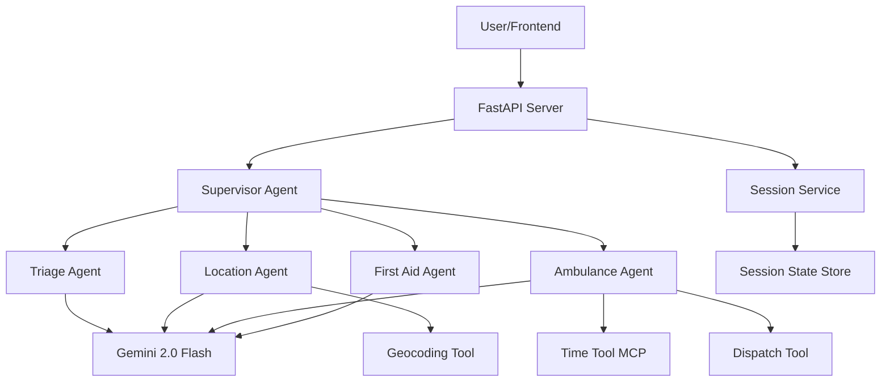
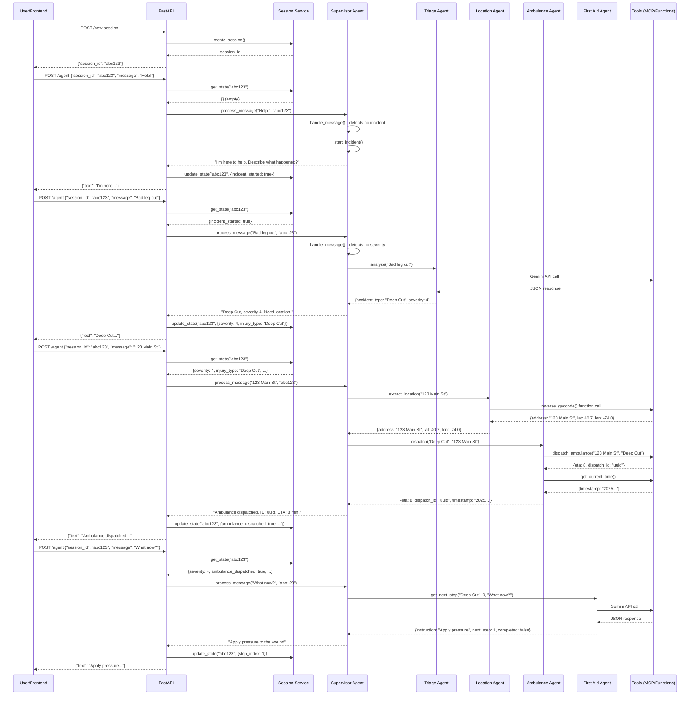

# Agent Before Ambulance - Complete End-to-End Documentation

## 📋 Project Overview

**Agent Before Ambulance** is an intelligent multi-agent AI system designed to provide critical emergency assistance before professional medical help arrives. The system leverages Google's Generative AI (Gemini) to create a sophisticated workflow that triages emergencies, dispatches ambulances, provides location services, and delivers step-by-step first aid guidance—all through a conversational interface.

### Key Objectives
- **Rapid Response**: Provide immediate assistance while waiting for ambulance arrival
- **Intelligent Triage**: Assess emergency severity using AI-powered analysis
- **Guided First Aid**: Deliver clear, step-by-step medical instructions
- **Smart Dispatch**: Automatically coordinate ambulance services for critical cases
- **Voice-First Interface**: Enable hands-free interaction during emergencies

---

## 🏗️ System Architecture

### Technology Stack

#### Backend
- **Framework**: FastAPI (Python)
- **AI/ML**: Google Generative AI (Gemini 2.0 Flash)
- **Session Management**: In-memory session service with state persistence
- **API Integration**: Google Geocoding API for location services
- **Error Handling**: Custom retry mechanism with exponential backoff

#### Frontend
- **Interface**: HTML5 + Vanilla JavaScript
- **Speech**: Web Speech API for voice input/output
- **Styling**: Modern CSS with glassmorphism and animations
- **Communication**: RESTful API calls to backend

#### Agent Development Kit (ADK) Features
- **Multi-Agent Orchestration**: Supervisor pattern with specialized agents
- **Tool Integration**: MCP (Model Context Protocol) tools
- **Session Persistence**: Stateful conversation management
- **Function Calling**: Native Gemini function calling for tools

### Component Architecture



---

## 🤖 Agent Descriptions

### 1. Supervisor Agent (`supervisor_agent.py`)

**Role**: Central orchestrator and workflow manager

**Responsibilities**:
- Routes user messages to appropriate specialized agents
- Maintains conversation state across multiple interactions
- Makes decisions about workflow progression
- Coordinates between multiple agents seamlessly

**Key Methods**:
- `process_message()`: Entry point from FastAPI, handles session loading/saving
- `handle_message()`: Main orchestration logic with intent detection
- `_start_incident()`: Initializes emergency workflow
- `_run_triage()`: Delegates to Triage Agent for severity assessment
- `_run_location_agent()`: Extracts user location
- `_run_ambulance_dispatch()`: Coordinates ambulance dispatch
- `_run_first_aid()`: Provides step-by-step first aid guidance
- `_detect_intent()`: Simple keyword-based intent classification

**State Management**:
```python
{
    "incident_started": bool,      # Has emergency been acknowledged
    "severity": int,                # 1-5 scale (None if not assessed)
    "injury_type": str,             # Type of injury (e.g., "Deep Cut")
    "ambulance_dispatched": bool,   # Has ambulance been sent
    "dispatch_eta": int,            # Minutes until ambulance arrival
    "dispatch_id": str,             # Unique dispatch identifier
    "dispatch_timestamp": str,      # ISO timestamp of dispatch
    "location": dict,               # {address, lat, lon}
    "step_index": int,              # Current first aid step
    "history": list                 # Conversation history
}
```

### 2. Triage Agent (`triage_agent.py`)

**Role**: Medical emergency severity assessor

**Responsibilities**:
- Analyzes user's description of the emergency
- Determines injury/accident type
- Assigns severity level (1-5 scale)
- Recommends whether ambulance dispatch is needed

**Input**: User's natural language description of emergency
**Output**: Structured JSON with:
```json
{
    "accident_type": "string",      // e.g., "Head Injury", "Deep Cut"
    "severity": 4,                  // 1 (minor) to 5 (critical)
    "dispatch_ambulance": true,     // True if severity >= 3
    "reasoning": "string"           // Explanation of assessment
}
```

**AI Model**: Gemini 2.0 Flash with JSON response mode
**Error Handling**: Retry with exponential backoff (2 retries, 0.5s initial delay)

### 3. Location Agent (`location_agent.py`)

**Role**: Geographic information extractor

**Responsibilities**:
- Extracts location information from user input
- Uses geocoding tool to validate and enrich addresses
- Provides structured location data for dispatch

**Tools Used**:
- `reverse_geocode()`: Custom function calling tool for address lookup

**Input**: User message containing location (e.g., "I'm at 123 Main St")
**Output**:
```json
{
    "address": "123 Main Street, City, State",
    "lat": 40.7128,
    "lon": -74.0060
}
```

**AI Model**: Gemini 2.0 Flash with function calling
**Error Handling**: Retry with exponential backoff (3 retries, 2s initial delay)

### 4. Ambulance Agent (`ambulance_agent.py`)

**Role**: Emergency dispatch coordinator

**Responsibilities**:
- Dispatches ambulance to specified location
- Generates dispatch ID and ETA
- Records timestamp of dispatch using MCP Time Tool
- Provides confirmation to user

**Tools Used**:
- `dispatch_ambulance(location, injury)`: Mock dispatch function
- `get_current_time()`: MCP tool for ISO timestamp

**Input**: Injury type, location
**Output**:
```json
{
    "eta": 8,                                    // Minutes
    "dispatch_id": "550e8400-e29b-41d4-a716...", // UUID
    "timestamp": "2025-11-30T11:48:03+05:30"    // ISO 8601
}
```

**AI Model**: Gemini 2.0 Flash with function calling
**Error Handling**: Retry with exponential backoff (2 retries, 0.5s initial delay)

### 5. First Aid Agent (`first_aid_agent.py`)

**Role**: Medical instruction provider

**Responsibilities**:
- Generates step-by-step first aid instructions
- Adapts guidance to specific injury type
- Provides one step at a time to avoid overwhelming user
- Tracks progress through first aid protocol

**Input**: Injury type, current step index, user response
**Output**:
```json
{
    "instruction": "Apply direct pressure to the wound",
    "next_step_index": 1,
    "completed": false
}
```

**Guidelines**:
- One step at a time
- Wait for user confirmation before next step
- Calm and reassuring tone
- Critical situations (e.g., CPR) are prioritized

**AI Model**: Gemini 2.0 Flash
**Error Handling**: Retry with exponential backoff (3 retries, 2s initial delay)

---

## 🔧 Technical Implementation Details

### Session Management

**File**: `backend/memory/session_service.py`

**Purpose**: Maintains isolated state for each user session

**Implementation**:
```python
class InMemorySessionService:
    _sessions = {}  # Class-level dictionary
    
    @classmethod
    def get_state(cls, session_id: str) -> dict
    
    @classmethod
    def update_state(cls, session_id: str, state: dict)
```

**Benefits**:
- Multiple users can interact simultaneously
- Each session has independent state
- Simple in-memory storage (suitable for demo/development)
- Can be extended to Redis/database for production

### MCP Tools Integration

**File**: `backend/tools/time_tool.py`

**Purpose**: Demonstrates Model Context Protocol (MCP) tool integration

**Implementation**:
```python
from datetime import datetime
from mcp import tool

@tool
def get_current_time() -> dict:
    return {"timestamp": datetime.now().isoformat()}
```

**Usage**: Called by Ambulance Agent during dispatch to record exact time

**Benefits**:
- Demonstrates ADK tool integration
- Provides audit trail for dispatches
- Shows extensibility for future tools

### Retry Mechanism

**File**: `backend/utils.py`

**Purpose**: Handle API rate limits and transient failures

**Implementation**:
```python
@retry_with_backoff(retries=3, initial_delay=0.5)
def api_call():
    # Your API call here
```

**Features**:
- Exponential backoff with jitter
- Handles Google API ResourceExhausted errors
- Configurable retry count and delay
- Prevents cascading failures

### API Endpoints

#### `POST /new-session`
- **Purpose**: Create new user session
- **Request**: Empty body
- **Response**: `{"session_id": "unique-id"}`
- **Usage**: Called once when user first loads the app

#### `POST /agent`
- **Purpose**: Send message to agent system
- **Request**:
  ```json
  {
      "session_id": "abc123",
      "message": "Help! I fell and hurt my leg"
  }
  ```
- **Response**:
  ```json
  {
      "text": "I understand. I'm here to help. Can you describe what happened?"
  }
  ```
- **Usage**: Called for each user message

### Frontend Interface

**File**: `frontend/index.html`, `frontend/app.js`, `frontend/style.css`

**Features**:
- **Voice Input**: Hold button to speak (Web Speech API)
- **Voice Output**: Agent responses read aloud (Speech Synthesis)
- **Visual Feedback**: Shows listening/processing states
- **Chat History**: Displays full conversation
- **Modern Design**: Glassmorphism, gradients, animations

**User Flow**:
1. User presses and holds microphone button
2. Speaks emergency description
3. Releases button to process
4. Agent response displayed and spoken aloud
5. Continues conversation until resolution

---

## 🔄 Complete Workflow

### Stage-by-Stage Breakdown

#### Stage 1: Incident Initialization
```
User: "Help!"
→ Supervisor detects incident_started = False
→ Calls _start_incident()
→ Sets incident_started = True
→ Response: "I understand. I'm here to help. Can you describe what happened?"
```

#### Stage 2: Triage Assessment
```
User: "My friend fell and hit his head, bleeding badly"
→ Supervisor detects severity = None
→ Calls _run_triage()
→ Triage Agent analyzes with Gemini
→ Returns: {accident_type: "Head Injury", severity: 4, dispatch_ambulance: true}
→ Updates state: severity=4, injury_type="Head Injury"
→ Response: "Thanks. Based on your description, this seems like a Head Injury 
   with severity level 4. This is serious. I may need to dispatch an ambulance. 
   Please provide your current location."
```

#### Stage 3: Location Extraction
```
User: "We're at 123 Main Street"
→ Supervisor detects severity >= 3 AND location = None
→ Calls _run_location_agent()
→ Location Agent extracts location with geocoding
→ Returns: {address: "123 Main Street, City, State", lat: 40.7128, lon: -74.0060}
→ Updates state: location = {address, lat, lon}
→ Automatically triggers ambulance dispatch since severity >= 3
```

#### Stage 4: Ambulance Dispatch
```
→ Supervisor calls _run_ambulance_dispatch() (auto-triggered)
→ Ambulance Agent calls dispatch_ambulance() function
→ Gets ETA and dispatch_id from tool
→ Calls get_current_time() MCP tool
→ Returns: {eta: 8, dispatch_id: "uuid-here", timestamp: "2025-11-30T11:48:03"}
→ Updates state: ambulance_dispatched=True, dispatch_eta=8, dispatch_id="uuid", timestamp="..."
→ Response: "I have your location: 123 Main Street, City, State. 
   Ambulance dispatched (ID: uuid-here). Estimated arrival time is 8 minutes. 
   Now let's focus on first aid."
```

#### Stage 5: First Aid Guidance
```
User: "What should I do?"
→ Supervisor detects all prerequisites met (severity known, location set, dispatch done)
→ Calls _run_first_aid()
→ First Aid Agent generates step based on injury_type and step_index
→ Returns: {instruction: "Apply direct pressure to the wound", next_step_index: 1, completed: false}
→ Updates state: step_index = 1
→ Response: "Apply direct pressure to the wound"

User: "Okay, done"
→ Calls _run_first_aid() with step_index=1
→ Returns: {instruction: "Keep pressure for 5 minutes while monitoring breathing", 
   next_step_index: 2, completed: false}
→ Updates state: step_index = 2
→ Response: "Keep pressure for 5 minutes while monitoring breathing"

[Process continues until completed=true]
```

### Full Interaction Example

````
User:    "Help!"
Agent:   "I understand. I'm here to help. Can you describe what happened?"

User:    "Car accident, deep cut on my arm, bleeding a lot"
Agent:   "Thanks. Based on your description, this seems like a Deep Cut injury 
          with severity level 4. This is serious. I may need to dispatch an 
          ambulance. Please provide your current location."

User:    "123 Main Street, downtown"
Agent:   "I have your location: 123 Main Street, Downtown. Ambulance dispatched 
          (ID: 550e8400-e29b-41d4-a716-446655440000). Estimated arrival time 
          is 8 minutes. Now let's focus on first aid. Apply direct pressure 
          to the wound with a clean cloth."

User:    "Okay, I'm doing that"
Agent:   "Good. Keep firm pressure and elevate your arm above your heart 
          if possible."

User:    "Done"
Agent:   "Continue holding pressure. Do not remove the cloth to check. 
          If it soaks through, add more cloth on top."

User:    "Okay"
Agent:   "Monitor for signs of shock (pale skin, rapid breathing). 
          Help should arrive in approximately 5 more minutes."
````

---

## 📊 Data Flow Diagram



---

## 🧪 Testing & Verification

### Manual Testing Procedure

#### Prerequisites
1. Start backend server:
   ```bash
   cd backend
   uvicorn main:app --reload --host 0.0.0.0 --port 8000
   ```
2. Use Postman, curl, or the frontend for testing

#### Test Case 1: Complete Emergency Workflow

**Objective**: Test full flow from initial contact through first aid

**Steps**:
1. Create session:
   ```bash
   curl -X POST http://localhost:8000/new-session
   ```
   Expected: `{"session_id": "generated-id"}`

2. Initial contact:
   ```bash
   curl -X POST http://localhost:8000/agent \
     -H "Content-Type: application/json" \
     -d '{"session_id": "test-1", "message": "Help!"}'
   ```
   Expected: "I understand. I'm here to help..."

3. Describe emergency:
   ```bash
   curl -X POST http://localhost:8000/agent \
     -H "Content-Type: application/json" \
     -d '{"session_id": "test-1", "message": "Fell and cut my arm badly, bleeding"}'
   ```
   Expected: Mentions severity level and requests location

4. Provide location:
   ```bash
   curl -X POST http://localhost:8000/agent \
     -H "Content-Type: application/json" \
     -d '{"session_id": "test-1", "message": "123 Main Street"}'
   ```
   Expected: Confirms location, dispatches ambulance, provides dispatch ID and ETA

5. Request first aid:
   ```bash
   curl -X POST http://localhost:8000/agent \
     -H "Content-Type: application/json" \
     -d '{"session_id": "test-1", "message": "What should I do?"}'
   ```
   Expected: First aid instruction for the injury type

#### Test Case 2: Session Isolation

**Objective**: Verify different sessions don't interfere

**Steps**:
1. Start session A with message "Help! Broken arm"
2. Start session B with message "Hello"
3. Send message to session A: "Where am I?"
4. Verify session B doesn't know about broken arm
5. Verify session A maintains context

#### Test Case 3: MCP Tool Integration

**Objective**: Verify time tool is called during dispatch

**Steps**:
1. Follow Test Case 1 through step 4 (location provided)
2. Check server logs for timestamp generation
3. Verify response contains timestamp in ISO format

**Expected Log Output**:
```
[DEBUG] Dispatching ambulance for Deep Cut
[DEBUG] Dispatch result: {'eta': 8, 'dispatch_id': 'uuid-here', 'timestamp': '2025-11-30T11:48:03.123456'}
```

#### Test Case 4: Severity-Based Routing

**Objective**: Verify minor injuries skip ambulance dispatch

**Steps**:
1. Start session: "Help!"
2. Describe minor injury: "I have a small paper cut"
3. Verify response mentions low severity (1-2)
4. Verify NO ambulance dispatch occurs
5. Verify moves directly to first aid

#### Test Case 5: Re-triage on Severe Keywords

**Objective**: Verify system re-assesses if severe symptoms mentioned later

**Steps**:
1. Start session: "Help!"
2. Minor injury: "Twisted my ankle"
3. Later message: "Actually, I can't feel my leg and there's a broken bone sticking out"
4. Verify system re-triages and escalates severity
5. Verify ambulance dispatch is triggered

### Frontend Testing

**Objective**: Test voice interface and UI

**Steps**:
1. Open `frontend/index.html` in browser
2. Grant microphone permissions
3. Hold microphone button and speak: "Help! Car accident!"
4. Verify:
   - Speech recognition captures text correctly
   - Agent response appears in chat
   - Response is spoken aloud
   - Visual state changes (listening, processing, ready)

### Error Handling Tests

**Objective**: Verify graceful degradation

**Test Scenarios**:
1. **API Rate Limit**: Send many rapid requests
   - Expected: Retry with backoff, eventual success
2. **Invalid Location**: Provide gibberish location
   - Expected: Request clarification or use as-is
3. **Network Failure**: Disconnect network mid-request
   - Expected: Error message, state preserved
4. **Invalid Session ID**: Use non-existent session
   - Expected: Creates new empty session

---

## 🚀 Deployment & Setup

### Installation

```bash
# Clone repository
git clone <repository-url>
cd AgentBeforeAmbulance

# Create virtual environment
python -m venv venv
source venv/bin/activate  # Windows: venv\Scripts\activate

# Install dependencies
cd backend
pip install -r requirements.txt
```

### Configuration

1. Create `.env` file in `backend/` directory:
   ```
   GOOGLE_API_KEY=your_gemini_api_key_here
   ```

2. Obtain API key from [Google AI Studio](https://makersuite.google.com/app/apikey)

### Running the Application

#### Backend
```bash
cd backend
uvicorn main:app --reload --host 0.0.0.0 --port 8000
```

#### Frontend
```bash
# Simple HTTP server
cd frontend
python -m http.server 8080
```

Then open http://localhost:8080 in your browser.

---

## 📁 Project Structure

```
AgentBeforeAmbulance/
├── backend/
│   ├── agents/
│   │   ├── __init__.py
│   │   ├── supervisor_agent.py      # Main orchestrator
│   │   ├── triage_agent.py          # Severity assessment
│   │   ├── location_agent.py        # Location extraction
│   │   ├── ambulance_agent.py       # Dispatch coordination
│   │   └── first_aid_agent.py       # Medical guidance
│   ├── memory/
│   │   ├── __init__.py
│   │   ├── session.py               # Session model
│   │   └── session_service.py       # State management
│   ├── tools/
│   │   ├── __init__.py
│   │   ├── time_tool.py             # MCP time tool
│   │   └── geocode.py               # Location tool
│   ├── main.py                      # FastAPI application
│   ├── utils.py                     # Retry logic
│   ├── requirements.txt             # Python dependencies
│   └── .env                         # API keys (not in git)
├── frontend/
│   ├── index.html                   # Main UI
│   ├── app.js                       # JavaScript logic
│   └── style.css                    # Styling
├── documentation.md                 # This file
└── README.md                        # Quick start guide
```

---

## 🎯 Key Features Demonstrated

### ADK (Agent Development Kit) Integration
✅ **Multi-Agent Architecture**: Supervisor coordinates 4 specialized agents
✅ **Session Management**: Stateful conversations with isolated sessions
✅ **Tool Integration**: MCP tools (time_tool) and function calling (geocode, dispatch)
✅ **Structured Outputs**: JSON mode for reliable parsing
✅ **Error Handling**: Exponential backoff retry mechanism

### AI/ML Capabilities
✅ **Natural Language Understanding**: Gemini processes free-form user input
✅ **Intent Detection**: Routes to appropriate agent based on context
✅ **Function Calling**: Agents use tools to accomplish tasks
✅ **Conversational State**: Maintains context across multiple turns

### Production Readiness Considerations
✅ **API Resilience**: Retry logic handles rate limits
✅ **Session Isolation**: Multi-user support with independent sessions
✅ **Logging**: Debug outputs for troubleshooting
✅ **CORS**: Frontend-backend communication enabled
✅ **Modular Design**: Easy to extend with new agents or tools

---

## 🔮 Future Enhancements

### Short Term
- [ ] Persistent session storage (Redis/PostgreSQL)
- [ ] Real-time location tracking with GPS
- [ ] Integration with actual emergency services APIs
- [ ] Multi-language support
- [ ] SMS/WhatsApp interface

### Long Term
- [ ] Image analysis (upload injury photos)
- [ ] Video call capability for visual assessment
- [ ] Integration with hospital systems
- [ ] Predictive analytics for ETA accuracy
- [ ] Offline mode with cached first aid protocols
- [ ] Medical history integration
- [ ] Prescription medication guidance

---

## 📞 Support & Contribution

For questions, issues, or contributions, please refer to the repository's issue tracker.

**Built with ❤️ using Google's Agent Development Kit (ADK)**
